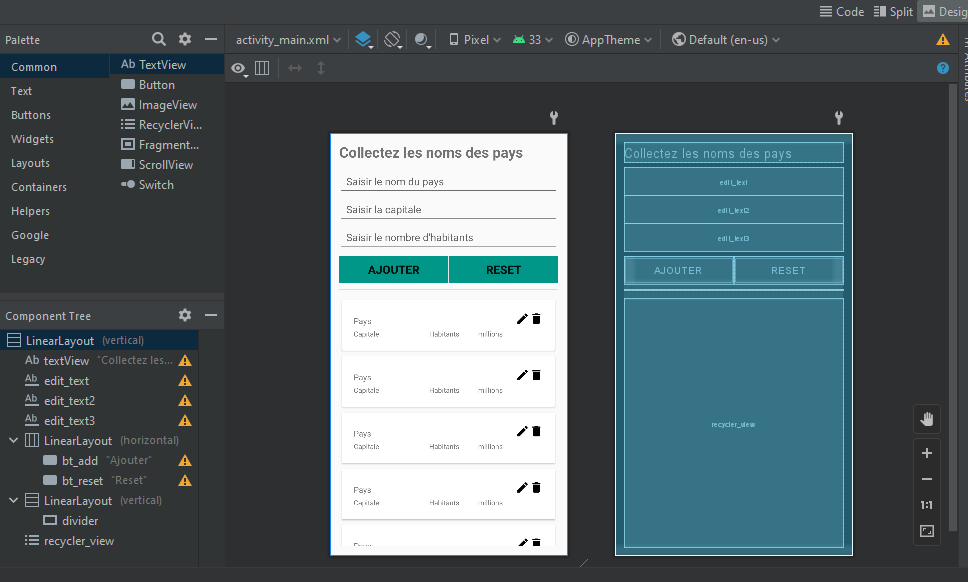
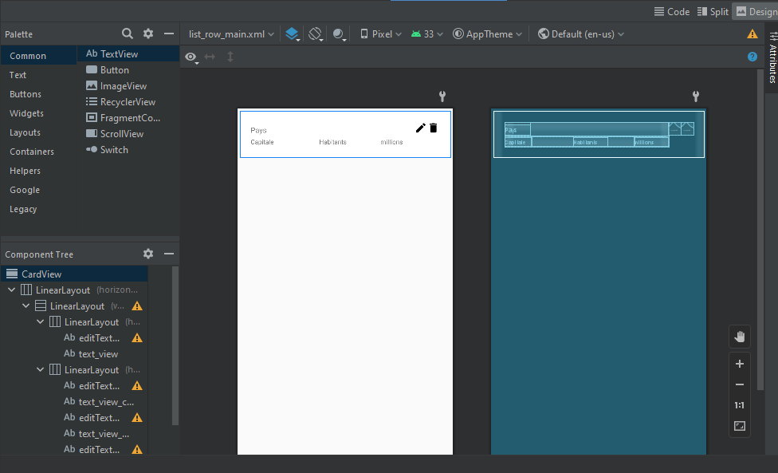
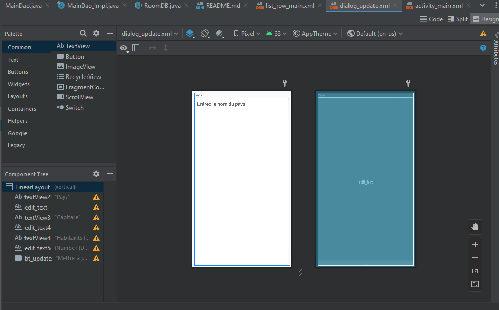
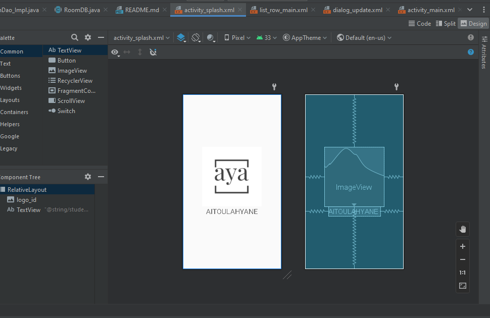

# Application : Gestion des pays

## Demonstration

https://github.com/no-aya/dev-mobile/assets/106016869/903be1ee-612c-4047-ab4f-87ef192b320c


## Description
Ce projet est une application de gestion des pays. 
Il permet de créer une liste de pays, leur captale et leur population.

On peut les modifier et les supprimer.


## Interfaces

### MainActivity
Cette interface permet d'afficher la liste des pays enregistrés dans la base de données.



Elle contient 
1- Des champs de saisie pour le nom du pays, sa capitale et sa population.
2- Un bouton pour enregistrer le pays
3- Un boutton pour réniialiser les champs de saisie
4- un `RecyclerView` pour afficher la liste des pays enregistrés dans la base de données.

### ListRowMain
Cette interface permet d'afficher les informations d'un pays dans le `RecyclerView` de l'interface `MainActivity`.



### DialogUpdate
Cette interface permet de modifier les informations d'un pays.




### ActivitySplach
Cette interface permet d'afficher le logo de l'application au démarrage.




### Manifest
Affin de lancer le splash screen au démarrage de l'application, il faut ajouter l'attribut `android.intent.action.MAIN` à l'activité `ActivitySplach` et l'attribut `android.intent.category.LAUNCHER` à l'activité `MainActivity`.

```xml

<manifest xmlns:android="http://schemas.android.com/apk/res/android"
    package="elmoumnaoui.zack.roomdatabasedemo">

    <application android:allowBackup="true" android:icon="@mipmap/ic_launcher"
        android:label="@string/app_name" android:roundIcon="@mipmap/ic_launcher_round"
        android:supportsRtl="true" android:theme="@style/AppTheme">
        <activity android:name=".SplashActivity" android:exported="true">
            <intent-filter>
                <action android:name="android.intent.action.MAIN" />
                <category android:name="android.intent.category.LAUNCHER" />
            </intent-filter>
        </activity>
        <activity android:name=".MainActivity" />
    </application>

</manifest>
```

